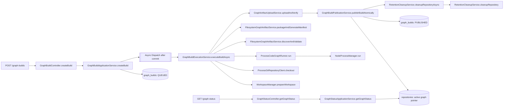

# code-graph-ingestion-service

## Overview

Code Graph Ingestion Service is a Spring Boot application that orchestrates graph builds for trusted source repositories.

It accepts build requests, resolves and validates Git commits, runs CodeGraph, packages artifacts, uploads them to storage, and atomically publishes the latest eligible result.

Current implementation status:

- Phases 0-8 implemented (control plane, async orchestration, Git integration, CodeGraph execution, packaging, storage upload, atomic publication, retention cleanup)
- Phase 9 paused (security/webhook integration not enabled yet)

## Tech Stack

- Java 21
- Spring Boot 4.1.1 (WebMVC + Spring Data JPA)
- PostgreSQL runtime
- H2 for tests
- Maven build
- Optional Azure Blob Storage integration

## Core Workflow

1. API accepts a build request for a repository and optional commit SHA.
2. Build record is created with status `QUEUED`.
3. Async worker starts after DB transaction commit.
4. Git checkout resolves requested commit.
5. CodeGraph runs for the checked-out source.
6. Output is validated and packaged as `tar.gz` + manifest.
7. Artifact is uploaded (local provider or Azure provider).
8. Publication is applied atomically with repository lock/revalidation.
9. Retention cleanup runs asynchronously.

Build lifecycle statuses:

- `QUEUED`
- `BUILDING`
- `VALIDATING`
- `PACKAGING`
- `UPLOADING`
- `PUBLISHED`
- `FAILED`

Repository graph statuses:

- `UNKNOWN`
- `BUILDING`
- `READY`
- `DEGRADED`

## API Endpoints

### Create Build

`POST /api/v1/repositories/{repositoryId}/graph-builds`

Request body:

```json
{
	"commitSha": "optional-commit-sha"
}
```

Notes:

- If `commitSha` is omitted/blank, service uses latest `main` commit.
- Duplicate `(repositoryId, commitSha)` requests return existing non-failed build.

Response: `202 Accepted`

```json
{
	"buildId": "uuid",
	"repositoryId": "repo-id",
	"commitSha": "resolved-or-requested-commit",
	"status": "QUEUED"
}
```

### Get Build Status

`GET /api/v1/repositories/{repositoryId}/graph-builds/{buildId}`

Response: `200 OK`

```json
{
	"buildId": "uuid",
	"repositoryId": "repo-id",
	"commitSha": "commit",
	"status": "PUBLISHED",
	"startedAt": "2026-10-05T10:30:00Z",
	"completedAt": "2026-10-05T10:31:00Z"
}
```

### Get Repository Graph Status

`GET /api/v1/repositories/{repositoryId}/graph-status`

Response: `200 OK`

```json
{
	"repositoryId": "repo-id",
	"activeCommitSha": "commit",
	"status": "READY",
	"graphUri": "file:///.../artifact.tar.gz",
	"targetCommitSha": null
}
```

## Configuration

Configured via `application.properties` (prefix `graph-ingestion`).

Important keys:

- `graph-ingestion.workspace.root`
- `graph-ingestion.git.command`
- `graph-ingestion.git.operation-timeout`
- `graph-ingestion.codegraph.node-command`
- `graph-ingestion.codegraph.startup-command`
- `graph-ingestion.codegraph.startup-timeout`
- `graph-ingestion.codegraph.build-timeout`
- `graph-ingestion.codegraph.shutdown-grace-period`
- `graph-ingestion.storage.provider` (`local` or `azure`)
- `graph-ingestion.storage.local.root`
- `graph-ingestion.storage.azure.account-url`
- `graph-ingestion.storage.azure.container`
- `graph-ingestion.storage.azure.path-prefix`
- `graph-ingestion.storage.max-attempts`
- `graph-ingestion.storage.initial-backoff`
- `graph-ingestion.storage.max-backoff`
- `graph-ingestion.retention.versions`
- `graph-ingestion.build.max-concurrent-builds`

## Data Model

Schema is managed using `src/main/resources/schema.sql`.

Main tables:

- `repositories` (active pointer, default branch, current graph state)
- `graph_builds` (build lifecycle, artifact metadata, error details)

## Running Locally

1. Ensure Java 21 and Maven are available.
2. Configure database connection (PostgreSQL for app runtime).
3. Configure writable workspace root and storage root.
4. Ensure Git and CodeGraph runtime commands are valid for your environment.
5. Start service:

```bash
./mvnw spring-boot:run
```

## Testing

Run all tests:

```bash
mvn -q test
```

Run key integration tests:

```bash
mvn -q -Dtest=GraphBuildApiIntegrationTest,GraphBuildCodeGraphFailureIntegrationTest,GraphBuildPublicationPolicyIntegrationTest,RetentionCleanupServiceIntegrationTest test
```

## Troubleshooting

### Optimistic lock failure during test setup cleanup

Symptom:

`ObjectOptimisticLockingFailureException` mentioning `delete from graph_builds where build_id=? and version=?`.

Cause:

- Entity-by-entity cleanup (`deleteAll()`) can race with async worker updates.

Fix:

- Use batch cleanup in test setup:
	- `graphBuildJpaRepository.deleteAllInBatch()`
	- `gitRepositoryJpaRepository.deleteAllInBatch()`

### Build remains in non-terminal status during tests

Check:

- Workspace path is writable.
- Git command is available.
- CodeGraph command in test/app config is executable.

## Repository Notes

- Implementation phase tracker and handoff log: `docs/implementation-phases.md`
- Security/webhook phase is intentionally deferred until Phase 9 is explicitly resumed.

## Processes Hosted In This Repository

This service currently hosts the following runtime processes:

1. HTTP API ingress for build creation and status queries.
2. Asynchronous build orchestration with lifecycle state transitions.
3. Workspace preparation and cleanup per build.
4. Git clone, commit resolution, lineage validation, and checkout.
5. CodeGraph runtime invocation through a managed process wrapper.
6. Artifact validation, packaging, and manifest generation.
7. Artifact upload and verification (local storage or Azure Blob).
8. Atomic publication and active pointer selection.
9. Retention cleanup of older published artifacts/build rows.
10. Repository graph status read model query.

## Process Flow Diagram



## Where To Start Reading The Code

Use this reading order if you are onboarding to the codebase.

| Process | Start Here | What To Follow Next |
|---|---|---|
| Application bootstrap | [CodeGraphIngestionServiceApplication](src/main/java/org/blr/CodeGraphIngestionServiceApplication.java) | Spring scans config and wires controllers/services from there |
| Build API (create + status) | [GraphBuildController.java](src/main/java/org/blr/api/GraphBuildController.java) (`createBuild`) | [GraphBuildApplicationService.java](src/main/java/org/blr/application/GraphBuildApplicationService.java) (`createBuild`) |
| Async build orchestration | [GraphBuildExecutionService.java](src/main/java/org/blr/application/GraphBuildExecutionService.java) (`executeBuildAsync`) | Follow each stage call in method order |
| Workspace lifecycle | [FilesystemWorkspaceManager.java](src/main/java/org/blr/workspace/FilesystemWorkspaceManager.java) (`prepareWorkspace`) | [FilesystemWorkspaceManager.java](src/main/java/org/blr/workspace/FilesystemWorkspaceManager.java) (`cleanupWorkspace`) |
| Git process | [ProcessGitRepositoryClient.java](src/main/java/org/blr/git/ProcessGitRepositoryClient.java) (`checkout`) | Internal helpers: `resolveCommitSha`, `validateCommitOnMain`, `runGit` |
| CodeGraph process | [ProcessCodeGraphRunner.java](src/main/java/org/blr/codegraph/ProcessCodeGraphRunner.java) (`run`) | [NodeProcessManager.java](src/main/java/org/blr/codegraph/NodeProcessManager.java) (`run`) |
| Artifact packaging | [FilesystemGraphArtifactService.java](src/main/java/org/blr/artifact/FilesystemGraphArtifactService.java) (`packageAndGenerateManifest`) | Also review `discoverAndValidate` in same class |
| Storage upload | [LocalGraphArtifactUploadService.java](src/main/java/org/blr/storage/LocalGraphArtifactUploadService.java) (`uploadAndVerify`) | Cloud path: [AzureBlobGraphArtifactUploadService.java](src/main/java/org/blr/storage/AzureBlobGraphArtifactUploadService.java) (`uploadAndVerify`) |
| Atomic publication | [GraphBuildPublicationService.java](src/main/java/org/blr/application/GraphBuildPublicationService.java) (`publishBuildAtomically`) | Revalidation and active pointer protection logic |
| Retention cleanup | [RetentionCleanupService.java](src/main/java/org/blr/application/RetentionCleanupService.java) (`cleanupRepositoryAsync`) | Core cleanup logic in `cleanupRepository` |
| Repository graph status API | [GraphStatusController.java](src/main/java/org/blr/api/GraphStatusController.java) (`getGraphStatus`) | [GraphStatusApplicationService.java](src/main/java/org/blr/application/GraphStatusApplicationService.java) (`getGraphStatus`) |
| Persistence layer | [schema.sql](src/main/resources/schema.sql) | JPA entities: [RepositoryEntity](src/main/java/org/blr/persistence/entity/RepositoryEntity.java), [GraphBuildEntity](src/main/java/org/blr/persistence/entity/GraphBuildEntity.java) |
| Error handling | [GlobalExceptionHandler](src/main/java/org/blr/error/GlobalExceptionHandler.java) | Error catalog in [ErrorCode](src/main/java/org/blr/error/ErrorCode.java) |

::: Code Generated by Copilot [4d9fe6dd-7b5a-4cca-8b8b-cfaf1dc176d3]. This comment will be removed automatically after the file is saved :::
## Suggested First 30-Minute Reading Path

1. Read [GraphBuildController](src/main/java/org/blr/api/GraphBuildController.java) and [GraphBuildApplicationService](src/main/java/org/blr/application/GraphBuildApplicationService.java).
2. Walk through [GraphBuildExecutionService.java](src/main/java/org/blr/application/GraphBuildExecutionService.java) (`executeBuildAsync`) top-to-bottom.
3. Open [ProcessGitRepositoryClient](src/main/java/org/blr/git/ProcessGitRepositoryClient.java), [ProcessCodeGraphRunner](src/main/java/org/blr/codegraph/ProcessCodeGraphRunner.java), and [FilesystemGraphArtifactService](src/main/java/org/blr/artifact/FilesystemGraphArtifactService.java).
4. Finish with [GraphBuildPublicationService](src/main/java/org/blr/application/GraphBuildPublicationService.java) and [RetentionCleanupService](src/main/java/org/blr/application/RetentionCleanupService.java).